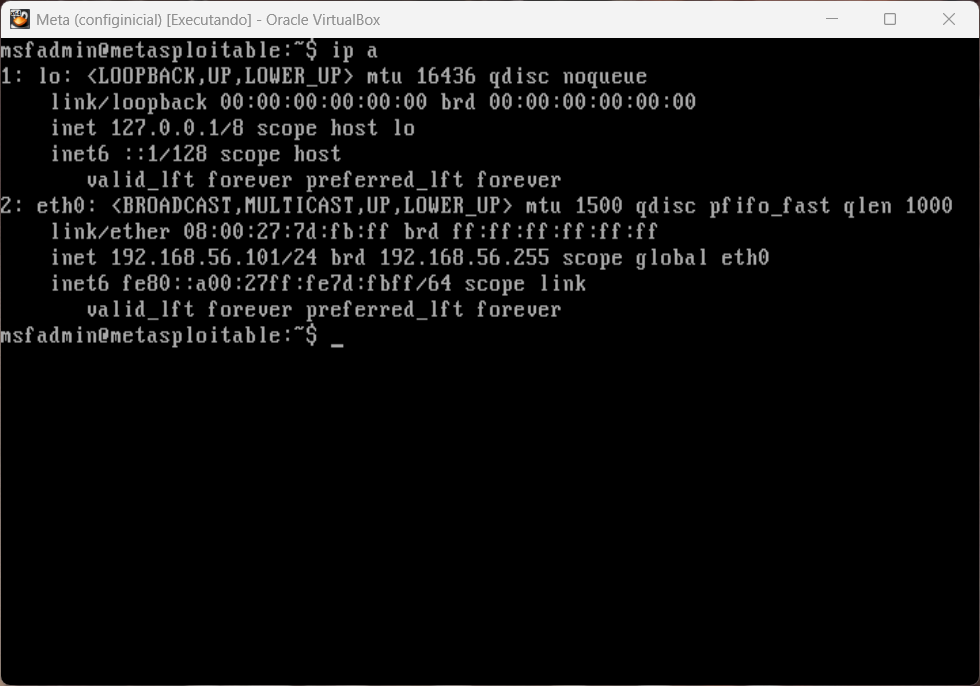
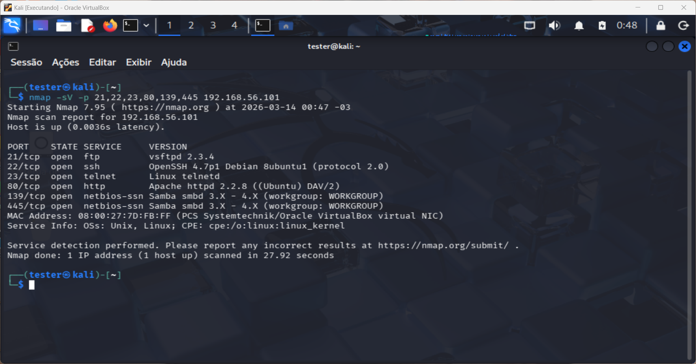
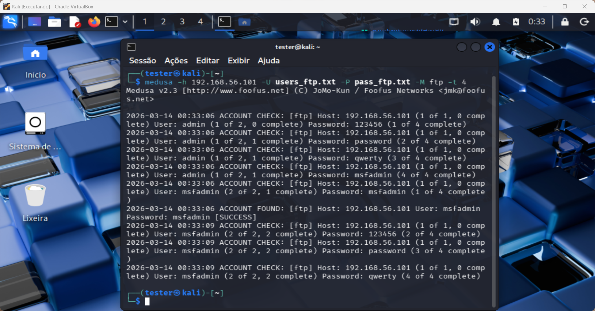
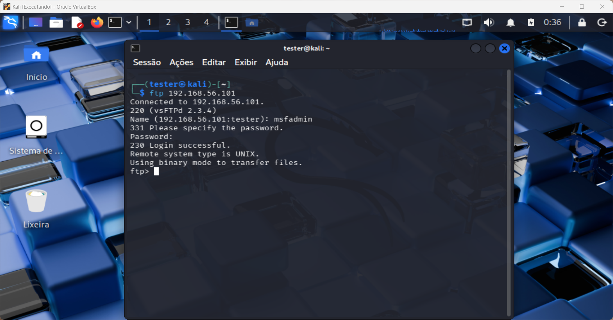
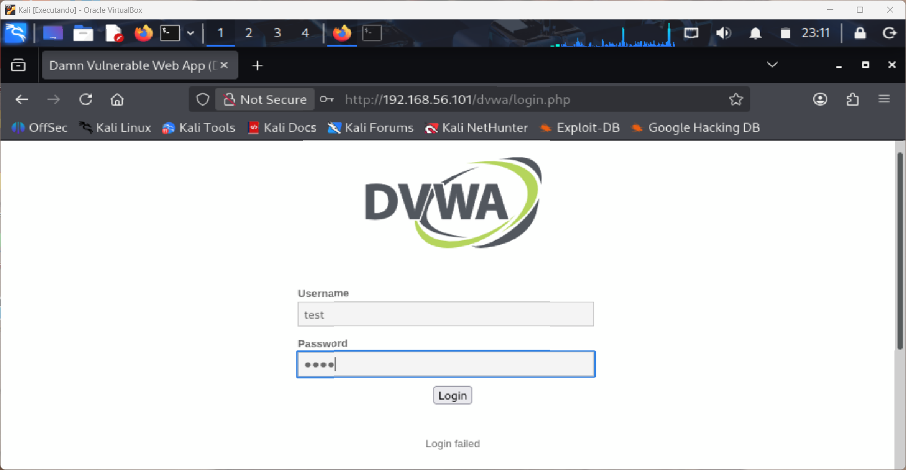
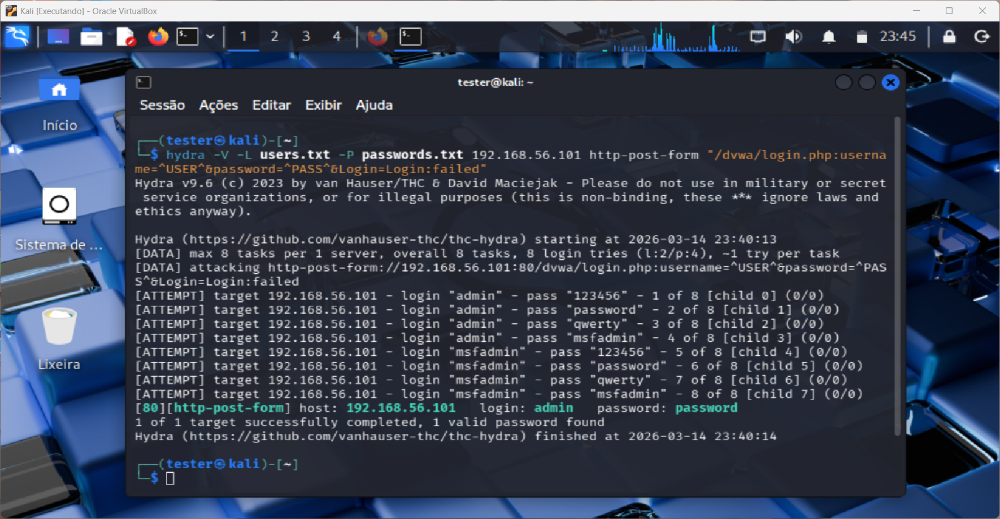
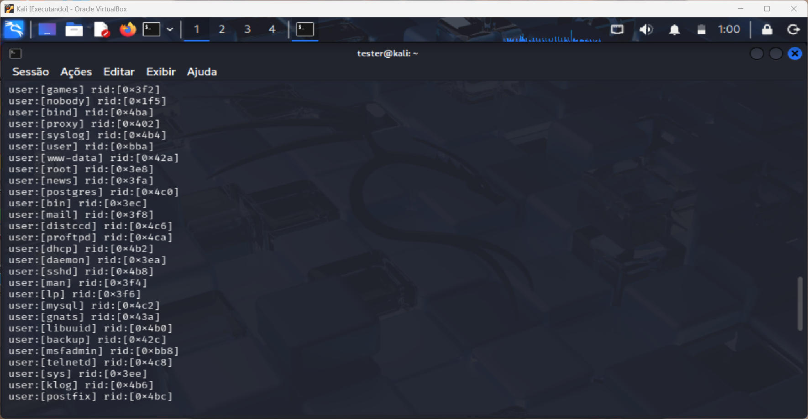
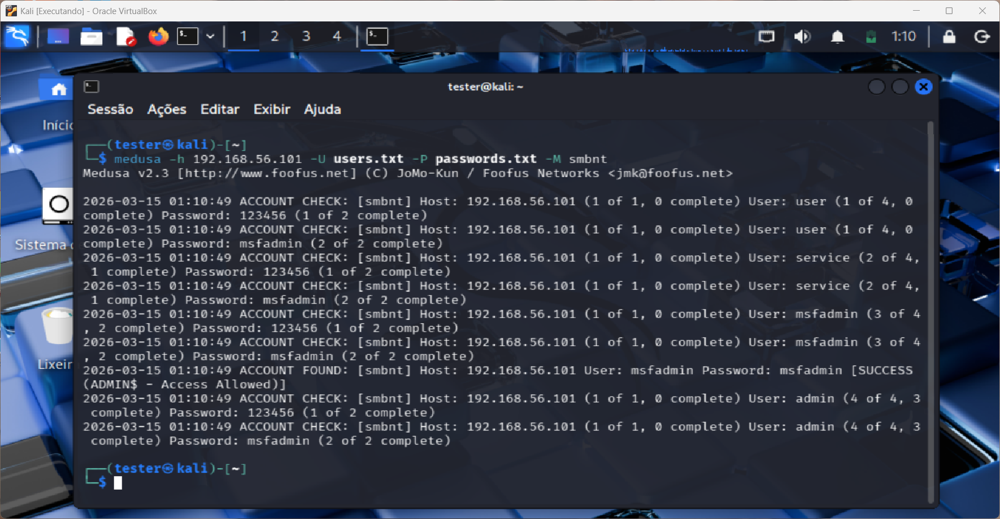

# 🔐 Desafio Cybersecurity Bootcamp DIO Riachuelo

Este projeto documenta a realização de testes de segurança em um ambiente controlado utilizando ferramentas de pentest presentes no Kali Linux.

O laboratório simula ataques de força bruta contra serviços vulneráveis da máquina Metasploitable 2, permitindo compreender como credenciais fracas podem comprometer sistemas expostos em rede.

Os testes foram realizados com foco educacional como parte de um desafio prático do bootcamp de Cybersecurity da DIO.

---

## Objetivo do Projeto

O objetivo deste laboratório é demonstrar na prática como ataques de força bruta podem ser realizados contra diferentes tipos de serviços, além de compreender técnicas básicas utilizadas durante processos de auditoria de segurança.

Durante o desafio foram simulados ataques contra:

- Serviço FTP
- Formulário de login Web (DVWA)
- Serviço SMB

Além disso, foram aplicadas etapas comuns em testes de segurança, como reconhecimento de rede, enumeração de usuários e validação de acesso após descoberta de credenciais.

---

## Ambiente do Laboratório

O ambiente foi configurado utilizando máquinas virtuais conectadas em uma rede interna (Host-Only) no VirtualBox.

### Máquina Atacante

- Kali Linux

### Máquina Alvo

- Metasploitable 2

A máquina atacante foi utilizada para executar ferramentas de auditoria de segurança e simular ataques de autenticação contra os serviços expostos pela máquina vulnerável.

---

## 🛠️ Ferramentas Utilizadas

- 🐉 Kali Linux
- 🔎 Nmap
- 🔐 Medusa
- ⚡ Hydra
- 🗂️ Enum4linux
- 🌐 DVWA (Damn Vulnerable Web Application)
- 🧪 Metasploitable 2

---

## Topologia do Laboratório

O ambiente utilizado neste laboratório foi configurado utilizando duas máquinas virtuais conectadas através de uma rede **Host-Only** no VirtualBox.

Essa configuração permite que as máquinas se comuniquem entre si sem acesso direto à internet, criando um ambiente isolado e seguro para realização dos testes.

Estrutura do laboratório:

Kali Linux (Máquina Atacante)

↓

Rede Host-Only

↓

Metasploitable 2 (Máquina Vulnerável)

A máquina Kali Linux foi utilizada para executar ferramentas de auditoria de segurança e simular ataques de força bruta contra os serviços expostos pela máquina Metasploitable 2.

---

## 🔎 Reconhecimento do Alvo

Antes de iniciar qualquer tentativa de exploração, foi realizada a etapa de **reconhecimento**, com o objetivo de identificar serviços ativos na máquina alvo.

Inicialmente foi identificado o endereço IP da máquina Metasploitable utilizando o comando:
```bash
ip a
```



---

Após identificar o endereço IP do alvo, foi realizado um scan de portas utilizando a ferramenta **Nmap** para identificar quais serviços estavam ativos.
```bash
nmap -p 21,22,23,25,80,139,445 <IP_DA_METASPLOITABLE>
```



O scan identificou alguns serviços importantes disponíveis na máquina vulnerável, incluindo:

- FTP (porta 21)
- HTTP (porta 80)
- SMB (porta 445)

Esses serviços foram utilizados como alvo para simulação de ataques de força bruta durante o laboratório.

---

## 🔓 Ataque 1 — Brute Force em FTP

Após identificar que o serviço **FTP** estava ativo na porta 21, foi realizado um teste inicial de conexão para verificar se o serviço estava acessível.
```bash
ftp <IP_DA_METASPLOITABLE>
```

Como o objetivo do laboratório era demonstrar um ataque de força bruta, foram criadas pequenas wordlists contendo possíveis usuários e senhas.

Essas listas foram criadas diretamente no terminal utilizando o comando `echo`.

Exemplo:
```bash
echo -e "admin\nmsfadmin" > users.txt
echo -e "123456\npassword\nadmin\nmsfadmin" > passwords.txt
```

Após a criação das wordlists, foi utilizada a ferramenta **Medusa** para realizar o ataque de força bruta contra o serviço FTP.
```bash
medusa -h <IP_DA_METASPLOITABLE> -U users.txt -P passwords.txt -M ftp
```



Durante o processo de tentativa de autenticação, a ferramenta identificou uma combinação válida de usuário e senha.

Após a descoberta das credenciais, foi possível realizar o login manual no serviço FTP utilizando a conta encontrada.



Esse teste demonstra como o uso de senhas fracas pode permitir que atacantes obtenham acesso a serviços expostos na rede através de técnicas automatizadas de força bruta.

---

## 🌐 Ataque 2 — Brute Force em Login Web

O segundo cenário do laboratório envolveu um ataque de força bruta contra um formulário de autenticação web da aplicação **DVWA (Damn Vulnerable Web Application)** hospedada na máquina Metasploitable.

Essa aplicação é intencionalmente vulnerável e amplamente utilizada em ambientes de estudo para demonstrar falhas comuns de segurança em aplicações web.

Inicialmente foi realizado um teste manual de autenticação utilizando credenciais aleatórias para identificar a resposta retornada pelo sistema em caso de falha no login.



Após identificar a mensagem de erro retornada pela aplicação, foi possível utilizá-la como parâmetro para automatizar o ataque de força bruta.

Para esse cenário foi utilizada a ferramenta **Hydra**, que permite realizar ataques automatizados contra diversos tipos de serviços, incluindo formulários de login web.

Assim como no ataque anterior, foram utilizadas pequenas wordlists contendo possíveis usuários e senhas criadas durante o laboratório.

O comando utilizado para executar o ataque foi:
```bash
hydra -L users.txt -P passwords.txt <IP_DA_METASPLOITABLE> http-post-form "/dvwa/login.php:username=^USER^&password=^PASS^&Login=Login:failed"
```

Durante o processo de tentativa de autenticação, a ferramenta conseguiu identificar uma combinação válida de usuário e senha.



Após a descoberta das credenciais, foi possível realizar o login manual na aplicação DVWA utilizando a conta encontrada.

Esse teste demonstra como formulários de autenticação web sem mecanismos de proteção contra múltiplas tentativas de login podem ser vulneráveis a ataques automatizados de força bruta.

---

## 🗂️ Ataque 3 — Enumeração SMB

O terceiro cenário do laboratório envolveu a análise do serviço **SMB (Server Message Block)** disponível na máquina Metasploitable.

O protocolo SMB é amplamente utilizado em ambientes Windows para compartilhamento de arquivos, impressoras e outros recursos de rede. Quando mal configurado, esse serviço pode permitir a enumeração de informações sensíveis, como usuários do sistema.

Inicialmente foi utilizada a ferramenta **Enum4linux** para realizar a enumeração de informações disponíveis no serviço SMB.
```bash
enum4linux -a <IP_DA_METASPLOITABLE>
```



A enumeração permitiu identificar alguns usuários existentes no sistema. Com essas informações foi possível montar uma lista de possíveis contas válidas para tentar autenticação.

Após identificar os usuários, foi realizado um ataque do tipo **password spraying** utilizando a ferramenta Medusa.

Diferente do brute force tradicional, o password spraying utiliza poucas senhas testadas contra múltiplos usuários, reduzindo a chance de bloqueio de contas em sistemas que possuem mecanismos de proteção contra várias tentativas de login consecutivas.

O comando utilizado para executar o ataque foi:
```bash
medusa -h <IP_DA_METASPLOITABLE> -U users.txt -P passwords.txt -M smbnt
```



Durante o processo de autenticação, a ferramenta conseguiu identificar uma combinação válida de usuário e senha.

Após a descoberta das credenciais, foi possível acessar os recursos compartilhados do serviço SMB e listar os compartilhamentos disponíveis no sistema.

Esse cenário demonstra como a combinação de **enumeração de usuários** e **senhas fracas** pode permitir que atacantes obtenham acesso a recursos internos da rede.

---

## 🛡️ Medidas de Mitigação

Os cenários apresentados neste laboratório demonstram como serviços expostos e protegidos por credenciais fracas podem ser comprometidos através de ataques automatizados.

Algumas boas práticas podem ajudar a reduzir significativamente o risco desse tipo de ataque:

- Utilização de **senhas fortes e complexas**
- Implementação de **políticas de bloqueio de conta** após múltiplas tentativas de login
- Uso de **autenticação multifator (MFA)**
- Monitoramento e análise de **logs de autenticação**
- Implementação de mecanismos de proteção contra brute force em aplicações web
- Restrição de acesso a serviços sensíveis através de **firewalls e segmentação de rede**

A adoção dessas medidas dificulta significativamente a exploração de sistemas por meio de ataques de força bruta.

---

## Estrutura do Repositório

A estrutura do repositório foi organizada para facilitar a visualização das evidências do laboratório e a documentação das etapas realizadas.

desafio-cybersecurity-bootcamp-dio-riachuelo
│
├ README.md
│
├ wordlists
│   ├ users.txt
│   └ passwords.txt
│
└ images
    ├ recon
    ├ ftp_attack
    ├ dvwa_attack
    └ smb_attack
    
As capturas de tela utilizadas durante os testes foram organizadas em pastas separadas de acordo com cada etapa do laboratório.

---

## Evidências do Laboratório

Todas as capturas de tela utilizadas durante a execução dos testes estão disponíveis na pasta **/images** deste repositório.

As imagens foram organizadas por etapa do laboratório para facilitar a análise das evidências:

- Reconhecimento da rede
- Ataque de força bruta em FTP
- Ataque de força bruta em formulário web (DVWA)
- Enumeração SMB e password spraying

Essa organização permite acompanhar de forma clara cada etapa do processo de exploração realizado durante o laboratório.

---

## Aviso Legal

Este projeto foi desenvolvido exclusivamente para fins **educacionais** em um ambiente de laboratório controlado.

Todos os testes foram realizados em máquinas vulneráveis criadas especificamente para estudo de segurança ofensiva.

Nenhum sistema real ou ambiente de produção foi utilizado durante os experimentos.

A execução dessas técnicas em sistemas sem autorização pode ser considerada atividade ilegal.

## Aprendizados

Durante a realização deste laboratório foi possível compreender na prática:

- Como identificar serviços expostos em uma rede utilizando Nmap
- Como ataques de força bruta funcionam em serviços FTP
- Como automatizar tentativas de login em aplicações web
- Como realizar enumeração de usuários em SMB
- Como ataques de password spraying podem comprometer contas com senhas fracas
